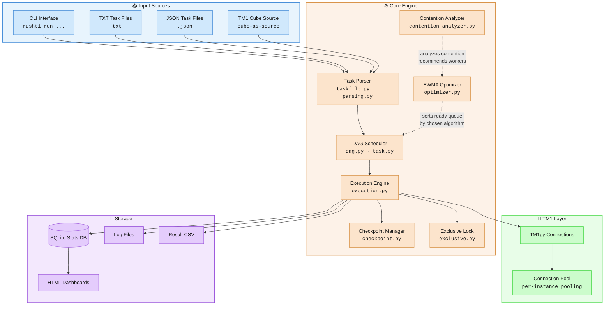
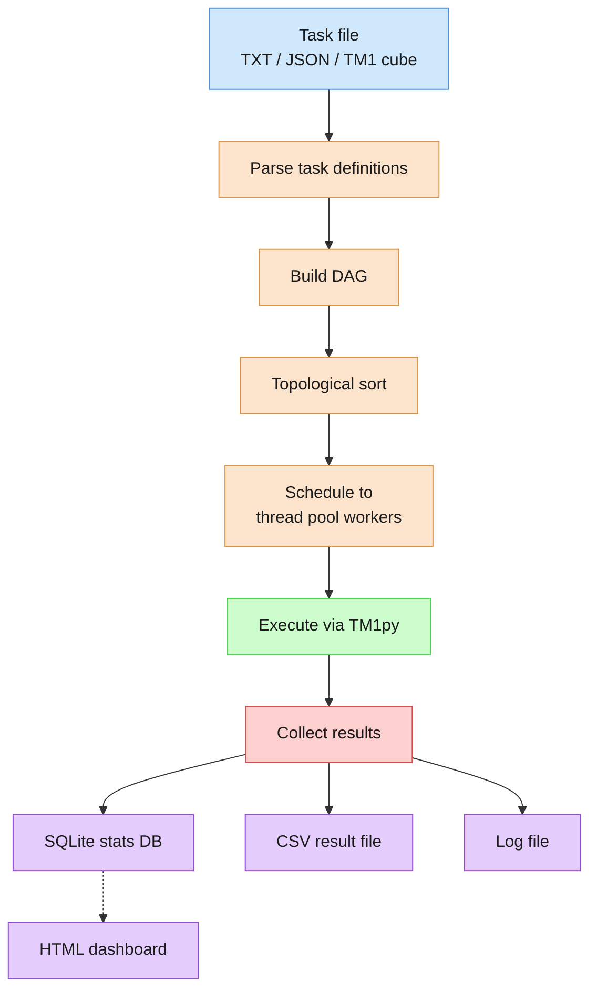
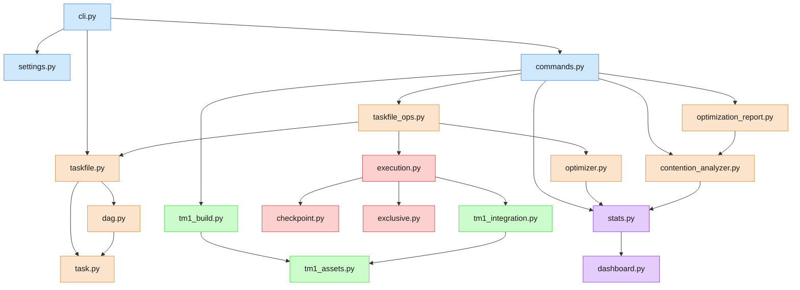

# Design Overview

High-level architecture of RushTI 2.0, the parallel execution engine for IBM TM1/Planning Analytics TurboIntegrator processes.

---

## Architecture Diagram

The diagram below shows the four main layers of RushTI and how data flows
between them.

### Layer Descriptions

| Layer | Responsibility |
|-------|---------------|
| **User Layer** | Accepts input from the CLI, task files (TXT or JSON), or a TM1 cube acting as the task source. |
| **Core Engine** | Parses tasks, builds and sorts the DAG, schedules work across parallel workers, and manages checkpoints. |
| **TM1 Layer** | Connects to TM1 instances via TM1py, manages connection lifecycle and pooling. |
| **Storage** | Persists execution statistics (SQLite), logs, and CSV result files. |

---

## Core Components

RushTI is split into focused modules under `src/rushti/`. Each module owns a
single concern.

### `cli.py` -- Entry Point

Argument parsing via `argparse`, subcommand registration, settings resolution,
and the top-level `main()` function. Delegates to handler functions in
`commands.py` for each subcommand (`run`, `resume`, `tasks`, `stats`, `db`,
`build`).

### `commands.py` -- Subcommand Handlers

Contains the handler functions for all RushTI subcommands:

- **build** -- Create TM1 logging dimensions and cube.
- **resume** -- Resume execution from a checkpoint. Returns a resume context
  dict that `main()` merges into CLI args (no module-level global state).
- **tasks** -- Taskfile operations (export, push, expand, visualize, validate).
- **stats** -- Statistics queries (export, analyze, visualize, list).
- **db** -- Database administration (list, clear, show, vacuum).

### `taskfile.py` -- Task File Parsing

Parses TXT and JSON task files into internal `Task` / `OptimizedTask` objects.
Handles taskfile metadata, settings, and expandable parameters. Provides
`TaskfileSource` for abstracting over file-based and TM1-cube-based sources.

### `task.py` -- Task Domain Model

Core task data classes: `Task`, `OptimizedTask`, `Wait`, and the
`ExecutionMode` enum. These are the fundamental units of work that RushTI
schedules and executes. Zero internal dependencies — this is the lowest
layer of the domain model.

### `dag.py` -- DAG Domain Model

The directed acyclic graph that models task dependencies: `DAG` class,
`TaskStatus` enum, `CircularDependencyError` exception, and DAG construction
helpers (`convert_norm_to_dag`, `convert_opt_to_dag`). Imports only from
`task.py`.

### `parsing.py` -- DAG Construction

Reads and pre-processes task files (including encoding normalization), parses
TXT lines into task objects, and builds a `DAG` from any supported format.

### `taskfile_ops.py` -- Taskfile Operations

Higher-level taskfile operations used by several subcommands:

- Expand MDX expressions and output a new task file.
- Validate taskfile structure and optionally check TM1 connectivity.
- Generate DAG visualizations (HTML from template in `templates/visualization.html`).
- Analyze historical runs and produce optimized task files.

### `execution.py` -- Execution Engine

The core execution loop. Uses an `ExecutionContext` dataclass to encapsulate
all per-run mutable state (logger, stats DB, task results). Manages TM1
service setup, connection lifecycle, process execution with retry and timeout
support, DAG-based task scheduling with parallel workers via
`ThreadPoolExecutor`, task validation against TM1 server metadata, and
structured execution logging.

### `settings.py` -- Settings Management

Loads `settings.ini`, resolves the settings precedence chain (CLI flags >
environment variables > JSON taskfile settings > settings.ini > defaults),
and validates configuration values.

### `stats.py` -- Statistics Database

SQLite database operations for recording execution results: run-level and
task-level metrics, historical queries, and data export. Used by the optimizer
and dashboard.

### `optimizer.py` -- Task Optimization

Runtime estimation and task ordering for optimized parallel execution. Uses
EWMA (Exponentially Weighted Moving Average) based on historical execution data
to sort ready tasks by estimated runtime using a configurable scheduling
algorithm (`longest_first` or `shortest_first`), improving parallel efficiency
while preserving dependency order.

### `contention_analyzer.py` -- Contention-Aware Optimization

Analyzes workflow execution history to detect resource contention patterns.
The main entry point is `analyze_contention()`, which performs a multi-step
analysis:

1. Compute EWMA durations from historical runs.
2. Identify which task parameter drives duration variance (contention driver).
3. Group tasks by the contention driver and detect heavy outliers using IQR.
4. Build predecessor chains to serialize heavy groups.
5. Recommend `max_workers` based on the chain structure.
6. Detect concurrency ceiling or scale-up opportunities from multi-run data.

Returns a `ContentionAnalysisResult` dataclass with all analysis outputs.
Also provides `write_optimized_taskfile()` to generate new task files with
predecessor chains and embedded `max_workers`.

### `optimization_report.py` -- HTML Optimization Report

Generates self-contained HTML reports for contention-aware optimization
results. Includes summary tables, contention driver charts, IQR statistics,
chain structure visualization, and concurrency ceiling/scale-up analysis.
Built with embedded CSS and Chart.js — no external dependencies.

### `dashboard.py` -- HTML Dashboard

Generates self-contained HTML dashboards with Chart.js for visualizing
execution history, run durations, task-level breakdowns, and trends.

### `checkpoint.py` -- Checkpoint Save/Load

Serializes in-progress execution state to disk so that a failed run can be
resumed from the last successful checkpoint via the `resume` subcommand.

### `exclusive.py` -- Exclusive Mode

Session management for exclusive-mode execution. Ensures only one RushTI
instance runs against a given TM1 server at a time by acquiring and releasing
exclusive locks.

### `tm1_integration.py` -- TM1 Cube Read/Write

Reads task definitions from a TM1 cube (cube-as-source) and writes execution
results back to TM1 cubes for server-side monitoring.

### `tm1_build.py` -- TM1 Logging Objects

Creates the TM1 dimensions and cube required for TM1-based logging when the
`build` subcommand is invoked.

### `tm1_assets.py` -- TM1 Asset Definitions

Defines the TM1 object structures (dimension names, element hierarchies, cube
definitions) used by `tm1_build.py` and `tm1_integration.py`.

### Supporting Modules

| Module | Purpose |
|--------|---------|
| `utils.py` | Stateless helper functions: `set_current_directory`, `get_application_directory`, `resolve_app_path`, `flatten_to_list`. |
| `messages.py` | Centralized user-facing log/error message templates and configuration constants. |
| `logging.py` | Structured execution logging via Python's standard logging framework, including `ExecutionRecord` dataclass. |
| `db_admin.py` | Database administration utilities: view summaries, list runs, clear data, export CSV, vacuum. |

---

## Data Flow

The end-to-end data flow for a typical `rushti run` invocation:

### Scheduling Detail

The DAG scheduler uses a **ready-queue** model:

1. All tasks with zero unresolved predecessors are placed in the ready queue.
2. Workers pull tasks from the queue and execute them.
3. When a task completes, the scheduler decrements the predecessor count of its
   successors; any successor whose count reaches zero enters the ready queue.
4. If optimization is enabled (via `--optimize <algorithm>` or JSON
   `optimization_algorithm`), the ready queue is sorted by estimated runtime
   using the chosen algorithm (`longest_first` or `shortest_first`).

---

## Key Design Decisions

### Thread-Based Parallelism

RushTI uses `concurrent.futures.ThreadPoolExecutor` (wrapped in an asyncio
event loop) rather than pure async I/O. This choice is driven by TM1py
compatibility -- TM1py's REST calls are synchronous, so threads provide
genuine concurrency without requiring an async TM1 client.

### Topological Sort for Dependency Order

Kahn's algorithm is used to produce a valid execution order. It also doubles as
a cycle-detection pass: if the algorithm terminates before visiting every node,
a `CircularDependencyError` is raised with the cycle path.

### Settings Precedence Chain

Settings can be specified at multiple levels. The resolution order (highest
priority first) is:

1. CLI flags (`--max-workers`, `--timeout`, etc.)
2. Environment variables (`RUSHTI_MAX_WORKERS`, etc.)
3. JSON taskfile `settings` block
4. `settings.ini` file
5. Built-in defaults

This allows operators to override taskfile-level settings without editing files
and lets CI pipelines inject configuration via environment variables.

### SQLite for Statistics

SQLite was chosen for the stats database because it requires zero setup, is
portable across platforms, ships with Python's standard library, and handles
the write volumes of a task runner without needing a server process.

### Self-Contained HTML Outputs

Dashboards and DAG visualizations are generated as single-file HTML documents
with all CSS, JavaScript (Chart.js), and data embedded inline. This means they
can be opened in any browser, attached to emails, or stored alongside log files
without external dependencies.

### Checkpoint and Resume

Long-running pipelines can be resumed after failure. The checkpoint file
captures enough state (completed task IDs, execution timestamps, original DAG)
to reconstruct the remaining work without re-running successful tasks.

### Exclusive Mode

When enabled, RushTI acquires an exclusive lock on the target TM1 instance
before execution begins. This prevents concurrent RushTI sessions from
interfering with each other during critical operations like data loads.

---

## Module Dependency Graph

A simplified view of how the main modules import from each other:

!!! note "Circular Import Avoidance"
    `commands.py` uses lazy imports for functions from `cli.py` (argument
    helpers, config resolution) to break potential circular import chains.

---

## Configuration Files

| File | Purpose |
|------|---------|
| `config/config.ini` | TM1 instance connection details (address, port, credentials). |
| `config/settings.ini` | Execution defaults (max workers, timeout, optimization flags). |
| `config/logging_config.ini` | Python logging configuration (handlers, formatters, log levels). |

---

## Error Handling Strategy

RushTI distinguishes between **recoverable** and **fatal** errors:

- **Recoverable**: A single task fails (process error, timeout). The scheduler
  marks the task as `FAILED`, optionally skips dependents, and continues
  executing independent branches of the DAG.
- **Fatal**: Configuration errors, circular dependencies, or unrecoverable
  connection failures. These abort the entire run with a clear error message.

Task-level errors are captured in the stats database and CSV output, allowing
post-run analysis without losing information about successful tasks.

---

## Further Reading

- [DAG Execution](../features/dag-execution.md) -- Why RushTI moved from level-based to
  DAG-based scheduling.
