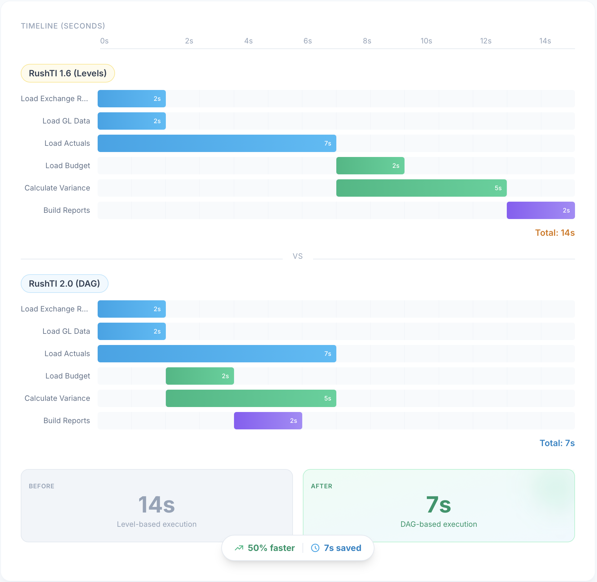

# DAG Execution

RushTI builds a dependency graph (DAG) from your task file and runs tasks in parallel, starting each one as soon as its specific dependencies complete — not when an entire "level" finishes.


## What Changed: Levels vs DAG

RushTI has always supported parallel execution with dependencies (using `id` and `predecessors` in optimized mode). What's new in v2.0 is **how** those dependencies are scheduled.

<figure markdown="span">
  { loading=lazy }
  <figcaption>Level-based scheduling waits for entire levels to finish; DAG scheduling starts each task as soon as its specific predecessors complete.</figcaption>
</figure>

In short: with levels, a task waits for every task in its level — even unrelated ones. With DAG, it only waits for its actual predecessors. Same task file, same `id`/`predecessors` — just smarter scheduling.

!!! tip "No task file changes needed"
    The task file format is identical. The improvement is in how RushTI executes it. You don't need to change your task files to benefit from DAG scheduling — just upgrade to RushTI 2.0.

---

## Working Example

Here is the `finance-close.json` sample that ships with RushTI. It defines 13 tasks across five stages: extract, transform, consolidate, report, and notify.

<figure markdown="span">
  { loading=lazy }
  <figcaption>The finance-close sample visualized as a DAG. Each node is a TI process; arrows show dependencies. Stages are color-coded.</figcaption>
</figure>

```bash
# Run it
rushti run --tasks docs/samples/finance-close.json --max-workers 8

# Visualize the DAG before running
rushti tasks visualize --tasks docs/samples/finance-close.json --output finance-close.html
```

When you run this workflow, RushTI starts all four extract tasks in parallel. As each extract finishes, its dependent transform task becomes ready immediately — no waiting for the other extracts.

---

## How to Define Dependencies

=== "JSON Format (Recommended)"

    Each task has an `id` (use integers) and an optional `predecessors` array:

    ```json
    {
      "version": "2.0",
      "metadata": { "workflow": "my-workflow" },
      "tasks": [
        {
          "id": "1",
          "instance": "tm1srv01",
          "process": "}bedrock.server.wait",
          "parameters": { "pWaitSec": "2" }
        },
        {
          "id": "2",
          "instance": "tm1srv01",
          "process": "}bedrock.server.wait",
          "parameters": { "pWaitSec": "5" }
        },
        {
          "id": "3",
          "instance": "tm1srv01",
          "process": "}bedrock.server.wait",
          "parameters": { "pWaitSec": "4" },
          "predecessors": ["1", "2"]
        }
      ]
    }
    ```

=== "TXT Format"

    Use `id=` and `predecessors=` fields. Separate multiple predecessors with commas:

    ```text
    id="1" predecessors="" instance="tm1srv01" process="}bedrock.server.wait" pWaitSec=2
    id="2" predecessors="" instance="tm1srv01" process="}bedrock.server.wait" pWaitSec=5
    id="3" predecessors="1,2" instance="tm1srv01" process="}bedrock.server.wait" pWaitSec=4
    ```

---

## What Happens at Runtime

1. **Parse and validate** — Load the task file, check for missing fields, duplicate IDs, and invalid predecessor references.
2. **Build the graph** — Create a directed acyclic graph from the `predecessors` relationships.
3. **Detect cycles** — Verify there are no circular dependencies (A→B→A).
4. **Queue root tasks** — Tasks with no predecessors are immediately ready to run.
5. **Execute in parallel** — Start ready tasks up to the `max_workers` limit.
6. **Unlock successors** — As each task completes, check if any successors now have all predecessors done. If so, queue them.
7. **Repeat** — Continue until all tasks are done or failures block remaining work.

---

## Failure Handling

### Default Behavior

By default, a task runs even if one of its predecessors failed. This is useful when downstream tasks can still produce partial results or when you want logging tasks to always run.

### Strict Mode

Set `require_predecessor_success` to skip a task when any predecessor fails:

```json
{
  "id": "5",
  "instance": "tm1srv01",
  "process": "}bedrock.server.wait",
  "parameters": { "pWaitSec": "2" },
  "predecessors": ["3", "4"],
  "require_predecessor_success": true
}
```

!!! warning "Use Strict Mode for Financial Workflows"
    In a financial close, you typically don't want to consolidate if a regional extract failed. Set `require_predecessor_success: true` on downstream tasks to prevent calculations on incomplete data.

---

## Visualize Your DAG

Before running a workflow, generate a visual diagram to verify your dependency structure:

```bash
rushti tasks visualize --tasks my-tasks.json --output dag.html
```

Open the HTML file in any browser to see an interactive graph with:

- Tasks as nodes, color-coded by stage
- Arrows showing dependency flow
- Click a node to see task details (instance, process, parameters)
- Search and filter by task ID or process name

### Validate Before Running

Check for structural problems without connecting to TM1:

```bash
rushti tasks validate --tasks my-tasks.json --skip-tm1-check
```

This catches: circular dependencies, missing predecessor references, duplicate task IDs, and missing required fields.

---

## Configuration

These settings control DAG execution behavior:

| Setting | Where | Default | Description |
|---------|-------|---------|-------------|
| `max_workers` | CLI / JSON / settings.ini | `4` | Maximum parallel tasks |
| `retries` | CLI / JSON / settings.ini | `0` | Retry count for failed tasks |
| `require_predecessor_success` | Per task | `false` | Skip task if any predecessor failed |
| `safe_retry` | Per task | `false` | Mark TI process as idempotent — RushTI will retry on connection loss |
| `timeout` | Per task | *(none)* | Max seconds before task is considered timed out |
| `cancel_at_timeout` | Per task | `false` | Cancel the TI process on the TM1 server when it times out |

```ini
# config/settings.ini
[defaults]
max_workers = 8
retries = 2
```

!!! info "`safe_retry`"
    When `safe_retry` is `true`, RushTI assumes the TI process is idempotent (safe to run again without side effects). If the TM1 connection is lost during execution, RushTI will automatically retry the task instead of marking it as failed. Useful for read-only extracts or processes with built-in duplicate handling.

Settings are resolved in priority order: CLI arguments > JSON task file settings > settings.ini > built-in defaults.

---

## Customize Further

- **[Performance Tuning](../advanced/performance-tuning.md)** — Worker sizing, critical path optimization
- **[Advanced Task Files](../advanced/advanced-task-files.md)** — Stages, timeouts, expandable parameters
- **[Task File Basics](../getting-started/task-files.md)** — Complete format reference (JSON and TXT)
- **[Self-Optimization](optimization.md)** — Let RushTI learn from past runs and optimize task ordering
