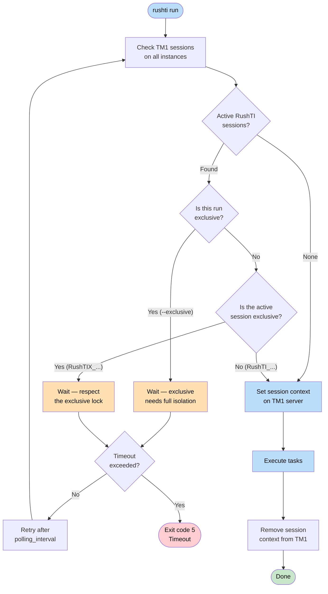

# Exclusive Mode

Exclusive mode prevents multiple RushTI instances from running simultaneously on the same TM1 server. Use it for workflows that should not overlap, like month-end close.

---

## Working Example

```bash
rushti run --tasks finance-close.json --exclusive
```

That single flag tells RushTI: "Before you start, make sure no other RushTI session is running on any TM1 server in this workflow. If one is, wait for it to finish."

### What You See (No Conflicts)

```
Checking for active RushTI sessions (exclusive mode)
No blocking sessions detected, proceeding with exclusive execution
RushTI starts. Session context: RushTIX_finance-close
...
RushTI ends. 0 fails out of 13 executions. Elapsed time: 2:15.3
```

### What You See (Another Session Is Running)

```
Checking for active RushTI sessions (exclusive mode)
Exclusive access required. Found 1 blocking session:
  RushTI session 'daily-refresh' (normal) on tm1-finance

Will retry every 30s until access granted or timeout (600s)

Still waiting for exclusive access (attempt 1, elapsed: 30s/600s)
Still waiting for exclusive access (attempt 2, elapsed: 60s/600s)

Exclusive access granted after waiting 75s
RushTI starts. Session context: RushTIX_finance-close
...
```

---

## How It Works



### Step by Step

1. RushTI checks **all TM1 instances** referenced in your task file for active RushTI sessions.
2. If another exclusive RushTI session is running, it waits and retries every 30 seconds (configurable).
3. Once clear, it sets a **session context** on the TM1 server (e.g., `RushTIX_finance-close`) so other RushTI instances can see it.
4. Other RushTI instances detect this context and wait.
5. When execution finishes, the session context is removed automatically.

### Session Context Format

RushTI identifies itself on each TM1 server through a session context string:

| Mode | Context Format | Example |
|------|---------------|---------|
| Normal | `RushTI_{workflow}` | `RushTI_daily-refresh` |
| Exclusive | `RushTIX_{workflow}` | `RushTIX_finance-close` |

The `X` in `RushTIX` marks an exclusive session. This is how RushTI instances coordinate without any external lock server -- they use TM1's own session monitoring.

### Blocking Rules

| Your Run | Active Session on TM1 | Behavior |
|----------|----------------------|----------|
| Exclusive | None | Proceeds immediately |
| Exclusive | Normal (`RushTI_...`) | Waits -- exclusive needs full isolation |
| Exclusive | Exclusive (`RushTIX_...`) | Waits -- only one exclusive at a time |
| Normal | None | Proceeds immediately |
| Normal | Normal (`RushTI_...`) | Proceeds -- normal runs can coexist |
| Normal | Exclusive (`RushTIX_...`) | Waits -- respects the exclusive lock |

!!! info "Multi-Instance Workflows"
    If your task file references multiple TM1 instances (e.g., `tm1-finance` and `tm1-reporting`), RushTI checks sessions on **all** of them. It only proceeds when every instance is clear.

---

## Configuration

### Settings in `config/settings.ini`

```ini
[exclusive_mode]
enabled = false
polling_interval = 30
timeout = 600
```

| Setting | Default | Description |
|---------|---------|-------------|
| `enabled` | `false` | Enable exclusive mode by default for all runs |
| `polling_interval` | `30` | Seconds between session checks while waiting |
| `timeout` | `600` | Maximum seconds to wait before giving up (exit code 5) |

### Three Ways to Enable

You can enable exclusive mode at different levels (highest priority first):

=== "CLI Flag"

    ```bash
    rushti run --tasks finance-close.json --exclusive
    ```

    Best for: one-time runs that need isolation.

=== "Task File Settings"

    ```json
    {
      "settings": {
        "exclusive": true
      },
      "tasks": [...]
    }
    ```

    Best for: workflows that should always run exclusively.

=== "settings.ini (All Runs)"

    ```ini
    [exclusive_mode]
    enabled = true
    ```

    Best for: environments where every workflow needs exclusive access.

### Setting Appropriate Timeouts

Choose a timeout based on how long your typical workflows take:

| Scenario | Recommended Timeout | Notes |
|----------|-------------------|-------|
| Quick daily refreshes | `300` (5 min) | Short wait, fail fast |
| Standard ETL pipelines | `600` (10 min) | Default, works for most cases |
| Month-end close | `3600` (1 hour) | Long workflows may need extended waits |
| Data migrations | `7200` (2 hours) | Large bulk loads can take a while |

```ini
[exclusive_mode]
timeout = 1800   # Wait up to 30 minutes
```

---

## When to Use Exclusive Mode

!!! tip "Use For"
    - **Month-end close** -- Financial processes that must not overlap
    - **Data migrations** -- Large bulk loads that need full server resources
    - **Dimension restructures** -- Changes to cube structures
    - **Any workflow that modifies shared objects** -- Processes that write to the same cubes concurrently

!!! warning "Do Not Use For"
    - **Daily refreshes** that can safely overlap with other work
    - **Read-only exports** and report generation
    - **User-specific workflows** that affect only private objects
    - **Development and testing** (unless you need to simulate production behavior)

---

## Timeout Behavior and Exit Codes

If the timeout is exceeded, RushTI exits with code **5**:

```
ERROR: Timeout (600s) exceeded waiting for exclusive access
Blocking sessions:
  RushTI session 'monthly-close' (exclusive) on tm1-finance
```

Handle this in your scheduling scripts:

```bash
#!/bin/bash
rushti run --tasks finance-close.json --exclusive

EXIT_CODE=$?

if [ $EXIT_CODE -eq 5 ]; then
    echo "Timed out waiting for exclusive access"
    # Alert the operations team or retry later
    exit 5
elif [ $EXIT_CODE -ne 0 ]; then
    echo "Workflow failed with exit code $EXIT_CODE"
    exit $EXIT_CODE
fi

echo "Workflow completed successfully"
```

### All RushTI Exit Codes

| Code | Meaning |
|------|---------|
| `0` | Success -- all tasks completed |
| `1` | Failure -- one or more tasks failed |
| `5` | Exclusive mode timeout -- could not get access |

---

## Checking Active Sessions

You can see active RushTI sessions through TM1 Architect:

1. Open **Server Explorer**
2. Right-click the TM1 server and select **Monitor**
3. Go to the **Threads** tab
4. Look for Context values containing `RushTI` or `RushTIX`

This is useful for troubleshooting timeout errors or verifying that a stuck session needs to be cancelled.

### Coordinating Scheduled Workflows

If you schedule multiple workflows, stagger them to reduce conflicts:

```cron
# Production ETL runs at 6 AM with exclusive mode
0 6 * * * rushti run --tasks prod-etl.json --exclusive

# Reports run at 9 AM without exclusive mode (read-only)
0 9 * * * rushti run --tasks daily-reports.json

# Backup runs at 2 AM with exclusive mode
0 2 * * * rushti run --tasks backup.json --exclusive
```

---

## Force Execution

In urgent situations, you can bypass exclusive mode checks:

```bash
rushti run --tasks emergency-load.json --exclusive --force
```

!!! danger "Use With Caution"
    The `--force` flag bypasses all session checks. Use it only when you have manually verified that no conflicting work is running. Running two exclusive workflows simultaneously can cause data corruption, lock conflicts, and process failures.

**When `--force` is appropriate:**

- A stuck session is blocking production and you have verified it is safe to proceed
- You are testing in an isolated environment
- You need an emergency data fix that cannot wait

---

## Troubleshooting

### Session Remains After RushTI Exits

If TM1 shows a RushTI session but the process has already finished, the session may not have been cleaned up properly (e.g., after an unexpected crash). Options:

- **Wait a few minutes** -- TM1 typically cleans up idle sessions automatically
- **Cancel the thread** in TM1 Architect (Monitor > Threads > right-click > Cancel)
- **Restart the TM1 service** as a last resort

### False Positive: Blocking on Own Session

RushTI automatically excludes its own session from blocking checks. If you see this behavior, it is likely a bug -- enable debug logging and report it:

```bash
rushti run --tasks workflow.json --exclusive --log-level DEBUG
```

---

## Customize Further

- **[CLI Reference](../advanced/cli-reference.md)** -- Complete CLI options for `--exclusive` and `--force`
- **[Settings Reference](../advanced/settings-reference.md)** -- Full `[exclusive_mode]` documentation
- **[Checkpoint & Resume](checkpoint-resume.md)** -- Recover from interruptions when exclusive mode times out
- **[DAG Execution](dag-execution.md)** -- How task scheduling works within an exclusive session
