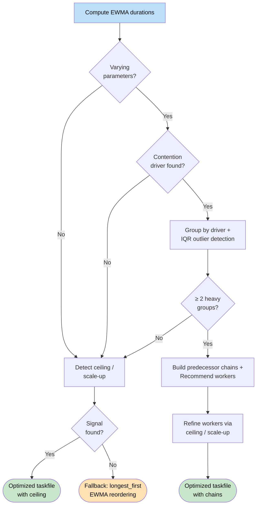

# Self-Optimization

RushTI learns from each run. It tracks how long each TI process takes, detects resource contention patterns, recommends optimal worker counts, and reorders tasks for better parallelization — all from historical execution data.

---

## How It Works

1. **Run your workflow** — RushTI records how long each task took in a local SQLite database.
2. **Build a performance picture** — After several runs, RushTI calculates a weighted average duration for each task (recent runs count more).
3. **Analyze and optimize** — Use `rushti stats optimize` for contention-aware analysis, or opt in to runtime scheduling with `--optimize` on the CLI.

The result: better worker utilization and shorter total execution time — without changing your task files.

!!! warning "Experimental"
    Contention-aware optimization is based on statistical analysis of historical execution data. The recommendations follow theoretical reasoning (IQR outlier detection, DAG scheduling, concurrency analysis) but actual TM1 server behavior depends on factors beyond task ordering — server load, memory pressure, concurrent users, and data volumes. There is no one-size-fits-all solution. **Test the optimized taskfile in a non-production environment before deploying.**

---

## Contention-Aware Optimization

The most advanced optimization mode. It analyzes *why* some tasks are slow, detects resource contention patterns, and restructures the task file to reduce contention.

```bash
rushti stats optimize --workflow daily-refresh
```

This produces an optimized task file with:

- **Predecessor chains** between heavy task groups to prevent them from running simultaneously
- **Worker count recommendations** based on observed server capacity
- **An HTML optimization report** with detailed analysis and visualizations

### When to Use It

Contention-aware optimization is most valuable when:

- Your workflow has tasks that share TM1 server resources (write locks, memory, threads)
- Some tasks are much slower than others due to data volume differences (e.g., one region has 10x more data)
- You suspect that too many concurrent heavy tasks are degrading performance
- You want data-driven guidance on the right `max_workers` setting

### How the Algorithm Works

The optimizer follows a multi-step decision tree. At each stage, it tries the most specific analysis first and falls back to simpler approaches when the data does not support deeper optimization.



The key insight: **contention driver** and **concurrency ceiling** are not mutually exclusive. When the algorithm finds a driver and builds chains (Step 7–8), it still runs ceiling/scale-up detection (Step 9) and uses the result to refine the worker count — capping down if the server is overwhelmed, or raising up if scale-up evidence is strong.

#### Step 1: Compute EWMA Durations

Using historical execution data, the optimizer calculates an EWMA (Exponentially Weighted Moving Average) duration for each unique task signature. This produces a reliable estimate of how long each task currently takes.

#### Step 2: Identify the Contention Driver

The optimizer examines which task parameter most strongly correlates with duration variance. For example, if tasks parameterized by `pRegion` show wildly different durations (NA=10s, EU=15s, APAC=120s) while tasks parameterized by `pYear` are similar, then `pRegion` is the **contention driver**.

The algorithm groups tasks by each varying parameter and measures the range of average group durations. The parameter with the largest range wins — it explains the most variance.

#### Step 3: Detect Heavy Outliers (IQR)

Once the contention driver is identified, the optimizer groups tasks by their driver value and uses IQR (Interquartile Range) statistics to detect **heavy outliers** — groups whose average duration is significantly above the rest.

```
Upper fence = Q3 + (k × IQR)
```

Groups above the upper fence are classified as "heavy." The sensitivity parameter `k` (default: 10.0) controls how conservative the detection is. Higher values mean fewer groups are flagged as heavy.

#### Step 4: Build Predecessor Chains

Heavy groups are chained together with predecessor dependencies so they run sequentially instead of simultaneously. This prevents multiple resource-intensive task groups from competing for TM1 server resources at the same time. At least 2 heavy groups are required to build chains.

```
Heavy Group A (120s) → Heavy Group B (95s) → Heavy Group C (80s)
```

If the workflow has fan-out parameters (e.g., tasks that vary by both `pRegion` and `pYear`), independent chains are created for each fan-out value, allowing parallelism across the non-contention dimensions.

#### Step 5: Recommend Worker Count

The optimizer calculates an optimal `max_workers` based on the chain structure:

```
recommended_workers = chain_slots + ceil(light_work / chain_duration)
```

Where `chain_slots` is the number of independent chains (fan-out size) and `light_work` accounts for non-heavy tasks that can run in parallel alongside the chains.

#### Step 6: Detect Concurrency Ceiling / Scale-Up

The optimizer also examines runs at different worker levels to detect:

- **Concurrency ceiling**: More workers made things *slower* (server overwhelmed). Recommends reducing workers.
- **Scale-up opportunity**: More workers made things *faster* and the current run uses fewer than optimal. Recommends increasing workers.

For scale-up recommendations, the optimizer uses a **sweet spot algorithm**: among all worker levels within 10% of the best wall clock time, it picks the one with the fewest workers. This avoids recommending far more workers when a smaller count achieves nearly the same speed.

This step runs in three contexts: (1) as a standalone fallback when no varying parameters or driver is found, (2) as a standalone fallback when < 2 heavy groups are detected, and (3) as a refinement after chains are built — where the ceiling/scale-up result either caps down or raises up the driver-based worker recommendation.

#### Automatic Fallback

If none of the above steps produce an actionable optimization (no driver, no ceiling, or a driver with insufficient heavy groups), the optimizer **automatically falls back** to standard `longest_first` EWMA reordering — the same analysis that `rushti stats analyze` produces. You always get an optimized output file.

### CLI Usage

```bash
# Basic: analyze a workflow (auto-resolves taskfile from archive)
rushti stats optimize --workflow daily-refresh

# Specify input taskfile and output path
rushti stats optimize \
  --workflow daily-refresh \
  --tasks daily-refresh.json \
  --output daily-refresh-optimized.json

# Adjust sensitivity (higher = more conservative outlier detection)
rushti stats optimize --workflow daily-refresh --sensitivity 15.0

# Analyze more historical runs with custom EWMA alpha
rushti stats optimize --workflow daily-refresh --runs 20 --ewma-alpha 0.5

# Skip HTML report generation
rushti stats optimize --workflow daily-refresh --no-report

# Custom report output path
rushti stats optimize --workflow daily-refresh --report-output analysis.html
```

| Option | Short | Type | Default | Description |
|--------|-------|------|---------|-------------|
| `--workflow` | `-W` | STR | *required* | Workflow name to analyze |
| `--tasks` | `-t` | PATH | *(auto)* | Input task file. If omitted, uses the archived taskfile from the most recent run. |
| `--output` | `-o` | PATH | *(auto)* | Output path for optimized task file. Default: `<taskfile>_optimized.json` |
| `--sensitivity` | | FLOAT | `10.0` | IQR multiplier for outlier detection. Higher = more conservative. |
| `--runs` | `-n` | INT | `10` | Number of recent runs for EWMA estimation |
| `--ewma-alpha` | | FLOAT | `0.3` | EWMA smoothing factor (0--1). Higher = more weight on recent runs. |
| `--no-report` | | FLAG | `false` | Skip generating the HTML optimization report |
| `--report-output` | | PATH | *(auto)* | Output path for HTML report. Default: alongside the optimized taskfile. |
| `--settings` | `-s` | PATH | auto | Path to `settings.ini` |

### Reading the Output

The command prints a summary to the terminal:

```
Contention Analysis for: daily-refresh
==================================================

Contention driver: pRegion
Fan-out parameters: pYear
Fan-out size: 3
Total tasks: 24

IQR statistics (sensitivity k=10.0):
  Q1: 12.3s
  Q3: 45.6s
  IQR: 33.3s
  Upper fence: 378.6s

Heavy groups (2):
  APAC: 420.5s (3 tasks)
  NA: 385.2s (3 tasks)

Light groups (6):
  EU: 45.6s (3 tasks)
  LATAM: 38.1s (3 tasks)
  ... and 4 more

Chain structure:
  Chain length: 2 heavy groups
  Chains: 3 independent chains
  Tasks with predecessors: 6
  Critical path: 805.7s

Recommended max_workers: 5
```

If a concurrency ceiling or scale-up opportunity is detected, additional information is displayed:

```
Scale-up opportunity detected: recommend increasing to 10 workers
  5 workers: 734s wall clock (slowest)
  10 workers: 581s wall clock (fastest)
  Potential improvement: 153s (20.8%)
```

### HTML Optimization Report

By default, `rushti stats optimize` generates an interactive HTML report alongside the optimized task file. The report includes:

- **Analysis summary** — contention driver, heavy/light group counts, recommended workers
- **Contention driver analysis** — bar chart comparing average durations per group
- **IQR statistics** — visual breakdown of the outlier detection thresholds
- **Chain structure** — how heavy groups are sequenced
- **Concurrency analysis** — worker level comparison with wall clock times and efficiency metrics
- **DAG visualization** — the optimized dependency graph with predecessor chains highlighted

The report is a self-contained HTML file (all CSS, JavaScript, and data embedded inline) that opens in any browser.

### Example: Before and After

**Before** — all tasks run in parallel, heavy regions compete for TM1 resources:

```
Worker 1: [APAC-2026 420s] ──────────────────────────
Worker 2: [NA-2026   385s] ──────────────────────
Worker 3: [APAC-2025 415s] ──────────────────────────
Worker 4: [NA-2025   380s] ──────────────────────
                            ↑ Heavy tasks compete for write locks
```

**After** — heavy groups are chained, light tasks fill gaps:

```
Worker 1: [APAC-2026 420s] ────────── → [NA-2026 385s] ──────────
Worker 2: [APAC-2025 415s] ────────── → [NA-2025 380s] ──────────
Worker 3: [EU-2026 46s] [LATAM-2026 38s] [EU-2025 44s] [LATAM-2025 36s]
                         ↑ Only one heavy group runs at a time per chain
```

---

## Scheduling Algorithms

For simpler workloads where contention-aware analysis is not needed, RushTI supports runtime scheduling algorithms that reorder ready tasks by estimated duration during execution.

| Algorithm | Sort Order | Best For |
|-----------|-----------|----------|
| `longest_first` | Longest tasks start first | Independent workloads with varied task durations. Starts expensive tasks early so short tasks fill gaps. |
| `shortest_first` | Shortest tasks start first | Shared-resource TM1 workloads where concurrent heavy tasks cause contention (memory, threads, write locks). |

### When to Use Which Algorithm

- **`longest_first`** — Classic bin-packing heuristic. Works well when tasks are independent and the TM1 server has headroom. Ideal for read-heavy extract workflows targeting multiple instances.
- **`shortest_first`** — Reduces peak resource pressure by completing quick tasks first, lowering the number of concurrent heavy tasks. Ideal for write-heavy loads against a single TM1 instance.

!!! tip "Not sure? Start with `shortest_first`"
    Most TM1 workloads involve shared server resources. `shortest_first` is a safer default for typical Planning Analytics environments.

### Enable Scheduling

Scheduling is **off by default**. You opt in explicitly per-run or per-taskfile.

#### Via CLI

```bash
# Shortest-first scheduling (good for shared-resource TM1 workloads)
rushti run --tasks daily-refresh.json --max-workers 20 --optimize shortest_first

# Longest-first scheduling (good for independent tasks with varied durations)
rushti run --tasks daily-refresh.json --max-workers 20 --optimize longest_first
```

#### Via JSON Task File

Set a default algorithm in the task file's settings section:

```json
{
  "settings": {
    "optimization_algorithm": "shortest_first"
  }
}
```

CLI `--optimize` overrides the JSON setting. Omitting both means no optimization.

#### EWMA Tuning (settings.ini)

The EWMA parameters that control how runtime estimates are calculated live in `settings.ini`. These are system-wide and rarely changed:

```ini
[stats]
enabled = true
retention_days = 90

[optimization]
lookback_runs = 10
min_samples = 3
```

!!! info "What's happening under the hood"
    When multiple tasks are ready to execute (i.e., all their predecessors have completed), RushTI sorts them by estimated runtime using the chosen algorithm before assigning them to workers. Dependencies are **never** changed; only the order among independent, ready tasks is affected.

### Requirements

- **`[stats] enabled = true`** — Optimization needs historical data. Without stats, there's nothing to learn from.
- **At least `min_samples` runs** — Tasks with fewer runs than `min_samples` use a default estimate and are placed after tasks with known durations.

---

## Before and After

Consider a simple workflow with six independent tasks and two workers:

**Before optimization (random order):**

```
Worker 1: [Short 2s] [Short 3s] [Long 30s] ──────── Total: 35s
Worker 2: [Short 1s] [Long 25s] ───── [Short 4s]    Total: 30s
                                              Overall: 35s
```

Worker 1 finishes early tasks quickly, then hits the long task last. Meanwhile Worker 2 sits idle waiting.

**After optimization (longest first):**

```
Worker 1: [Long 30s] ──────────── [Short 2s] [Short 1s]  Total: 33s
Worker 2: [Long 25s] ───── [Short 4s] [Short 3s]         Total: 32s
                                                   Overall: 33s
```

Both workers stay busy throughout. The total time drops because long tasks start immediately and short tasks fill in the remaining gaps.

!!! tip "Real-World Gains"
    The improvement depends on how unbalanced your tasks are. Workflows with a mix of 5-second and 5-minute tasks see the biggest gains. Workflows where all tasks take roughly the same time see less benefit.

---

## Configuration

| Setting | Location | Default | Description |
|---------|----------|---------|-------------|
| `--optimize` | CLI | *(none)* | Scheduling algorithm: `longest_first` or `shortest_first`. No flag = no optimization. |
| `optimization_algorithm` | JSON taskfile | *(none)* | Per-taskfile default algorithm. Overridden by CLI `--optimize`. |
| `lookback_runs` | settings.ini | `10` | Number of recent runs to analyze for EWMA estimates |
| `min_samples` | settings.ini | `3` | Minimum successful runs before optimization kicks in |
| `cache_duration_hours` | settings.ini | `24` | How long to cache duration estimates between runs |
| `time_of_day_weighting` | settings.ini | `false` | Weight runs at similar times of day higher (disables caching) |

### How Duration Estimates Work (EWMA)

RushTI uses EWMA (Exponentially Weighted Moving Average) to estimate task durations:

- **Recent runs matter more.** If a process used to take 10 seconds but now takes 20 seconds (because data volumes grew), the estimate adjusts toward 20 seconds.
- **Old outliers fade away.** A one-time spike from a server hiccup does not permanently distort the estimate.
- **The smoothing factor (alpha) is 0.3.** Each new run contributes 30% to the estimate, and the accumulated history contributes 70%.

For most TM1 environments, the default alpha works well. If your process durations change rapidly (for example, during a data migration), see [Performance Tuning](../advanced/performance-tuning.md) for EWMA tuning details.

### Time-of-Day Weighting

Some TI processes run faster at night when the server is idle and slower during business hours. Enable `time_of_day_weighting` to give more weight to runs that happened at a similar time of day:

```ini
[optimization]
time_of_day_weighting = true
```

!!! note
    When `time_of_day_weighting` is enabled, caching is disabled — RushTI recalculates estimates fresh each run to account for the current time of day.

### Choosing `min_samples`

| Workflow Type | Recommended `min_samples` | Reason |
|--------------|--------------------------|--------|
| Stable daily ETL | `3` | Durations are consistent |
| Variable workloads | `5-10` | Need more data points to smooth out variation |
| Seasonal processes | `10-20` | Data volumes change significantly |

---

## Manual Analysis (Optional)

In addition to automatic optimization, RushTI includes a manual analysis tool for generating reports and optimized task files:

```bash
rushti stats analyze \
  --workflow daily-refresh \
  --tasks daily-refresh.json \
  --output daily-refresh-optimized.json
```

This reads your execution history, calculates EWMA estimates, and writes a new task file with tasks reordered for optimal execution. This is useful for:

- **Reviewing performance** — see which tasks are getting slower or faster
- **Sharing an optimized file** — distribute a pre-optimized task file to a team that hasn't enabled automatic optimization
- **Auditing** — compare the original and optimized order to understand what changed

### What the Report Shows

| Field | Description |
|-------|-------------|
| `task_id` | The task identifier from your task file |
| `avg_duration` | Simple average across all analyzed runs |
| `ewma_duration` | Weighted average (recent runs matter more) |
| `min_duration` | Fastest observed execution |
| `max_duration` | Slowest observed execution |
| `run_count` | Number of runs analyzed |

**Reading the results:**

- **EWMA < Average** — The task is getting faster over time
- **EWMA > Average** — The task is getting slower (investigate data volumes or TI process performance)
- **EWMA ≈ Average** — Stable performance

---

## TM1 Integration

If you have [TM1 Integration](tm1-integration.md) enabled (`push_results = true`), optimization data is also visible in TM1. The `rushti` cube stores task durations for every run, so you can build Planning Analytics dashboards that show:

- Which tasks are getting slower over time
- Which workflows benefit most from optimization
- Historical duration trends per TI process
- Success rates and failure patterns

---

## Frequently Asked Questions

### Does optimization change my task dependencies?

No. Optimization only reorders tasks that are independent of each other (tasks at the same depth in the DAG with no shared predecessors). Your dependency chains are never modified.

### How many runs do I need before optimization helps?

At least 3 runs (the `min_samples` default). With fewer runs, the duration estimates are unreliable and RushTI skips optimization for those tasks. For best results, aim for 5-10 runs.

### What is the difference between `stats analyze` and `stats optimize`?

- **`stats analyze`** — Reorders tasks by EWMA-estimated duration (longest first). Useful for basic bin-packing optimization.
- **`stats optimize`** — Performs contention-aware analysis: detects which parameter drives duration variance, identifies heavy outlier groups, builds predecessor chains to prevent heavy tasks from running simultaneously, and recommends an optimal worker count. Produces an HTML report.

Use `stats analyze` for simple duration-based reordering. Use `stats optimize` when you suspect resource contention is the bottleneck.

### Which scheduling algorithm should I use?

- **`shortest_first`** — Best for most TM1 workloads, especially write-heavy processes against a single TM1 instance. Reduces peak resource contention.
- **`longest_first`** — Best for independent, read-heavy workloads spread across multiple TM1 instances. Classic bin-packing heuristic.

When in doubt, start with `shortest_first`.

### Can I set a default algorithm per task file?

Yes. Add `"optimization_algorithm"` to the JSON task file's settings section. The CLI `--optimize` flag overrides this value at runtime:

```json
{
  "settings": {
    "optimization_algorithm": "shortest_first"
  }
}
```

### Can I optimize a TXT task file?

Yes. Optimization works with both JSON and TXT task files. Use `--optimize <algorithm>` on the CLI. The `stats analyze` command also works with both formats.

### What if I add new tasks to the workflow?

New tasks will not have historical duration data, so RushTI treats them as unknown and places them after tasks with known durations. After a few runs, the new tasks accumulate enough data to be included in optimization.

### Can I use optimization with exclusive mode?

Yes. Optimization and exclusive mode are independent features:

```bash
rushti run --tasks daily-refresh.json --max-workers 4 --exclusive --optimize shortest_first
```

### How does the sweet spot algorithm work for worker recommendations?

When the optimizer detects that more workers led to faster execution (scale-up), it does not simply recommend the highest worker count observed. Instead, it finds all worker levels within 10% of the best wall clock time and picks the one with the fewest workers. This avoids recommending 50 workers when 10 workers achieves 95% of the same speed.

### What does "sensitivity" control?

The `--sensitivity` flag (default: 10.0) is the IQR multiplier `k` used for outlier detection. The upper fence is `Q3 + k * IQR`. Higher values make detection more conservative (fewer groups flagged as heavy). Lower values flag more groups as heavy. For most workloads, the default works well.

### Are contention driver and concurrency ceiling mutually exclusive?

No. When the algorithm finds a contention driver and builds predecessor chains, it also runs concurrency ceiling / scale-up detection to refine the worker count. The two signals work together: the driver produces chains and a base worker recommendation, the ceiling/scale-up adjusts that recommendation based on observed server capacity across runs.

### What happens when contention analysis finds nothing?

The optimizer always produces an output. If no contention driver or concurrency ceiling is found, it automatically falls back to standard `longest_first` EWMA reordering — the same analysis that `rushti stats analyze` produces. Similarly, if a driver is found but fewer than 2 heavy groups are detected (so no chains can be built) and no ceiling signal exists, the fallback kicks in.

---

## Best Practices

1. **Enable stats from the start.** Even if you do not plan to optimize immediately, having historical data ready is valuable. It costs almost nothing in overhead.

2. **Let it learn.** After enabling optimization, the first few runs build the performance picture. Gains become visible after `min_samples` runs.

3. **Combine with manual tuning.** Optimization reorders tasks but does not make individual TI processes faster. If the stats show a process taking 5 minutes, consider optimizing the TI process itself (better MDX, fewer loops, targeted data clears).

4. **Use `time_of_day_weighting` for mixed schedules.** If the same workflow runs both during business hours and overnight, enable time-of-day weighting to account for load differences.

5. **Run contention analysis after worker tuning.** After you have experimented with different `max_workers` values (see [Performance Tuning](../advanced/performance-tuning.md)), run `rushti stats optimize` to get a data-driven recommendation and detect resource contention patterns.

6. **Vary worker counts across runs.** The concurrency ceiling and scale-up detection require runs at different `max_workers` values. Run your workflow at 2--3 different worker levels to give the optimizer enough data for multi-run comparison.

7. **Test before deploying.** Contention-aware optimization follows statistical reasoning, but TM1 server behavior can be unpredictable. Always validate the optimized taskfile in a test or staging environment before using it in production.

---

## Customize Further

- **[Performance Tuning](../advanced/performance-tuning.md)** — EWMA alpha tuning, worker sizing, and advanced optimization strategies
- **[Statistics & Dashboards](statistics.md)** — The stats database that powers optimization
- **[Settings Reference](../advanced/settings-reference.md)** — Complete `[optimization]` and `[stats]` settings
