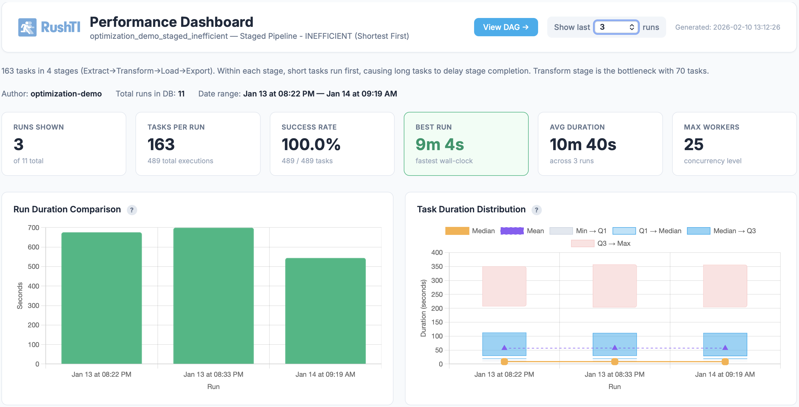
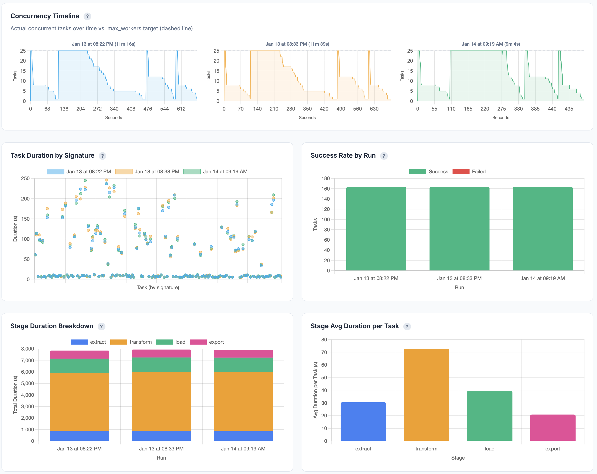

# Statistics & Dashboards

RushTI tracks every run in a local SQLite database. You can query execution history, export reports, and generate interactive HTML dashboards — no database server required.

<figure markdown="span">
  { loading=lazy }
  <figcaption>Interactive HTML dashboard generated with <code>rushti stats visualize</code> — run durations, task-level breakdowns, success rates, and concurrency timelines.</figcaption>
</figure>

---

## Working Example

### Enable Stats

Add two lines to `config/settings.ini`:

```ini
[stats]
enabled = true
retention_days = 90
```

That's it. Every run is now tracked automatically.

### Run a Workflow

```bash
rushti run --tasks daily-refresh.json --max-workers 4
```

After execution, check what was recorded:

```bash
rushti db list workflows
```

```
Workflows (2)
================================================================================
Workflow                                 Runs     Tasks    Last Run
--------------------------------------------------------------------------------
daily-refresh                            12       6        2026-02-09T10:15:00
finance-close                            3        13       2026-02-08T22:00:00
```

### Generate a Dashboard

```bash
rushti stats visualize --workflow daily-refresh --output dashboard.html
```

Open `dashboard.html` in any browser to see an interactive dashboard with run durations over time, task-level breakdowns, success rates, and a concurrency timeline.

!!! tip "Share Dashboards With Your Team"
    The generated HTML file is fully self-contained — no web server needed. Email it to your team, save it to a shared drive, or open it directly from the file system in any browser.

### Export to CSV

```bash
rushti stats export --workflow daily-refresh --output results.csv
```

Open the CSV in Excel or any reporting tool for further analysis.

---

## CLI Commands Overview

### Stats Commands

| Command | Description |
|---------|-------------|
| `rushti stats list runs --workflow ID` | List runs for a workflow |
| `rushti stats list tasks --workflow ID` | List tasks for a workflow |
| `rushti stats export --workflow ID` | Export run data to CSV |
| `rushti stats visualize --workflow ID` | Generate interactive HTML dashboard |
| `rushti stats analyze --workflow ID` | Analyze runs and suggest optimizations |

### Database Commands

| Command | Description |
|---------|-------------|
| `rushti db list workflows` | List all tracked workflows and run counts |
| `rushti db show run --run-id ID` | Show details for a specific run |
| `rushti db show task --signature SIG` | Show execution history for a task |
| `rushti db vacuum` | Compact the database to reclaim disk space |
| `rushti db clear` | Clear data (by workflow, run, date, or all) |

---

## What the Dashboard Shows

The HTML dashboard generated by `rushti stats visualize` includes several views:

### Run Duration Over Time

A line chart showing total execution time for each run. Spot trends like gradually increasing runtimes (possibly due to growing data volumes) or sudden spikes (possibly a server issue).

### Task-Level Breakdown

A stacked bar chart showing how long each task took within a run. Quickly identify which TI processes dominate your execution time.

### Success Rates

A summary showing the percentage of tasks that succeeded, failed, or were skipped across all tracked runs. Use this to identify unreliable TI processes that need attention.

### Concurrency Timeline

A chart showing actual concurrent tasks over time vs. the `max_workers` target (dashed line). Use this to verify that your DAG dependencies allow enough parallelization and that workers stay busy.

<figure markdown="span">
  { loading=lazy }
  <figcaption>Concurrency timeline for each run — the blue/green line shows actual parallel tasks over time, the dashed line is the <code>max_workers</code> target. Gaps indicate idle workers; flat lines at the target indicate full utilization.</figcaption>
</figure>

---

## A Complete Workflow

Here is how stats, dashboards, and optimization work together in practice:

```bash
# 1. Enable stats in your settings
# (Already done in config/settings.ini)

# 2. Run your workflow (stats are captured automatically)
rushti run --tasks daily-refresh.json --max-workers 4

# 3. After a few runs, check what you have
rushti db list workflows

# 4. List recent runs for a specific workflow
rushti stats list runs --workflow daily-refresh

# 5. Generate a dashboard to review performance
rushti stats visualize --workflow daily-refresh --output dashboard.html

# 6. Export raw data for deeper analysis in Excel
rushti stats export --workflow daily-refresh --output results.csv

# 7. Analyze and generate an optimized task file
rushti stats analyze \
  --workflow daily-refresh \
  --tasks daily-refresh.json \
  --output daily-refresh-optimized.json
```

---

## Configuration

### Stats Settings

```ini
[stats]
enabled = true
retention_days = 90
```

| Setting | Default | Description |
|---------|---------|-------------|
| `enabled` | `false` | Turn on statistics tracking |
| `db_path` | `data/rushti_stats.db` | Path to the SQLite database file |
| `retention_days` | `90` | Days to keep historical data. `0` = keep forever |

### Where Data Is Stored

The stats database is a single SQLite file, defaulting to:

```
data/rushti_stats.db
```

You can change the location via `db_path` in `settings.ini`:

```ini
[stats]
enabled = true
db_path = /var/data/rushti/stats.db
```

Relative paths are resolved from the application directory. No database server, no connection strings, no maintenance. The file is created automatically on the first run after enabling stats.

### Taskfile Archive

Each run archives the taskfile as JSON under:

```
archive/{workflow}/{run_id}.json
```

This happens automatically regardless of the original source format (JSON, TXT, or TM1 cube). The archived taskfile allows historical DAG reconstruction for any past run — even if the original file has changed or been deleted. The `taskfile_path` column in the `runs` table points to the archived file.

!!! tip "Portable and Simple"
    You can copy `rushti_stats.db` to another machine, open it with any SQLite tool (like DB Browser for SQLite), and query your execution history directly with SQL.

---

## What Gets Tracked

For every run, RushTI records:

**Run-level data:**

- Workflow and path
- Start time, end time, total duration
- Task counts (total, succeeded, failed, skipped)
- Settings used (workers, retries, exclusive mode)
- Overall status (Success, Partial, Failed)

**Task-level data:**

- TM1 instance and TI process name
- Parameters passed to the process
- Start time, end time, duration
- Status (Success, Fail, Skipped)
- Error message (if failed)
- Retry count
- Predecessors, stage, timeout settings

!!! info "No Sensitive Data"
    The stats database stores execution metadata only. It does not store cube data, cell values, or TM1 credentials.

---

## Database Management

### List Tracked Workflows

```bash
rushti db list workflows
```

```
Workflows (4)
================================================================================
Workflow                                 Runs     Tasks    Last Run
--------------------------------------------------------------------------------
Sample_Stage_Mode                        2        5        2026-01-20T17:51:36
daily-refresh                            12       6        2026-02-09T10:15:00
finance-close                            3        13       2026-02-08T22:00:00
optimization_demo_staged_inefficient     11       163      2026-01-14T09:27:31
```

### Compact the Database

After many runs, the database may have unused space from deleted records (retention cleanup). Compact it:

```bash
rushti db vacuum
```

### Clear Data

Clear data by workflow, run, date, or everything:

```bash
# Delete all data for a specific workflow
rushti db clear --workflow old-workflow

# Delete a specific run
rushti db clear --run-id 20260115_103000

# Delete data older than a date
rushti db clear --before 2025-01-01

# Preview what would be deleted (without actually deleting)
rushti db clear --workflow old-workflow --dry-run

# Delete everything (requires confirmation)
rushti db clear --all
```

!!! danger "Irreversible"
    `rushti db clear --all` deletes all execution history. Use only when you need a completely fresh start.

### Automatic Cleanup

When `retention_days` is set, RushTI automatically deletes records older than the retention period. Cleanup happens at startup and after each run.

```ini
[stats]
retention_days = 30     # Keep 1 month of history
retention_days = 90     # Keep 3 months (default)
retention_days = 365    # Keep 1 year
retention_days = 0      # Keep everything forever (monitor disk space)
```

---

## Using Stats for Optimization

The statistics database directly powers RushTI's [Self-Optimization](optimization.md) feature. When optimization is activated (via `--optimize <algorithm>` on the CLI or `optimization_algorithm` in a JSON task file), RushTI uses historical data to reorder ready tasks during execution.

You can also manually generate an optimized task file:

```bash
rushti stats analyze \
  --workflow daily-refresh \
  --tasks daily-refresh.json \
  --output daily-refresh-optimized.json
```

See [Self-Optimization](optimization.md) for the full details.

---

## Best Practices

### 1. Enable Stats From Day One

Even if you do not plan to optimize immediately, enable stats tracking from the start. It costs almost nothing in overhead and gives you historical data when you need it later.

### 2. Set Reasonable Retention

Balance storage space and analysis needs. For most teams, 90 days gives you enough history for optimization and trend analysis without letting the database grow too large.

### 3. Review Dashboards Monthly

Generate a dashboard once a month to catch performance trends early:

```bash
rushti stats visualize --workflow daily-refresh --output monthly-review.html
```

Look for:

- **Gradually increasing durations** — Data volumes may be growing
- **Sporadic failures** — Unreliable TI processes that need attention
- **Low worker utilization** — Dependencies may be too conservative

### 4. Back Up the Database

The stats database is just a file. Include it in your regular backups:

```bash
cp data/rushti_stats.db data/rushti_stats_backup.db
```

---

## Customize Further

- **[Self-Optimization](optimization.md)** — Use stats data to optimize task ordering
- **[TM1 Integration](tm1-integration.md)** — Push stats to a TM1 cube for PA dashboards
- **[Performance Tuning](../advanced/performance-tuning.md)** — Analyze stats to tune worker counts and identify bottlenecks
- **[Settings Reference](../advanced/settings-reference.md)** — Complete `[stats]` settings documentation
