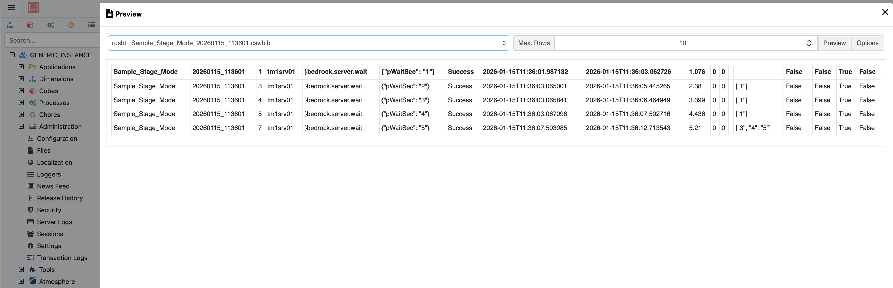

# TM1 Integration

RushTI can read task definitions directly from a TM1 cube and write execution results back. This lets you manage workflows entirely within Planning Analytics.

---

## Two Main Capabilities

### 1. Read Tasks from TM1

Store your task definitions in a TM1 cube instead of JSON files. TM1 administrators can update workflows from Architect, Perspectives, or PAW — no file editing required.

### 2. Write Results to TM1

After each run, RushTI pushes execution results (duration, status, errors) back to the same cube. Build dashboards in Planning Analytics to monitor your workflows.

---

## Working Example

### Set Up the TM1 Objects

Run the `build` command to create the required cube and dimensions on your TM1 server:

```bash
rushti build --tm1-instance tm1srv01 --settings config/settings.ini
```

This creates:

| Object | Type | Purpose |
|--------|------|---------|
| `rushti` | Cube | Stores task definitions and execution results |
| `rushti_workflow` | Dimension | Identifies each workflow (e.g., `daily-refresh`) |
| `rushti_task_id` | Dimension | Task sequence numbers (1 through 5000) |
| `rushti_run_id` | Dimension | Run timestamps plus an `Input` element for task definitions |
| `rushti_measure` | Dimension | Data fields: instance, process, parameters, status, duration, etc. |

The build command also loads sample workflows (`Sample_Stage_Mode`, `Sample_Normal_Mode`, `Sample_Optimal_Mode`) so you can test immediately.

!!! info "What Gets Created"
    The `rushti_measure` dimension contains elements for every task property: `instance`, `process`, `parameters`, `status`, `start_time`, `end_time`, `duration_seconds`, `retries`, `error_message`, `predecessors`, `stage`, and more.

### Define Tasks in the Cube

Open the `rushti` cube in Architect or PAW. With `rushti_run_id = "Input"`, you can see and edit your task definitions. Here is the `Sample_Stage_Mode` workflow viewed with the `rushti_inputs_norm` subset:

<figure markdown="span">
  { loading=lazy }
  <figcaption>The <code>rushti</code> cube in TM1 Architect — task definitions for Sample_Stage_Mode. Each row is a task with instance, process, parameters, and wait columns. Rows with <code>wait = true</code> act as group separators (like the <code>wait</code> keyword in TXT files).</figcaption>
</figure>

Each task is defined by writing values to these measures:

| Measure | Description |
|---------|-------------|
| `instance` | TM1 server name (must match a `[section]` in config.ini) |
| `process` | TI process name to execute |
| `parameters` | JSON string, e.g. `{"pWaitSec": "1"}` |
| `wait` | Set to `true` to create a wait point (normal mode) |
| `predecessors` | Comma-separated task IDs (optimized mode) |
| `stage` | Optional stage name for grouping |

### Run Tasks from TM1

```bash
rushti run --tm1-instance tm1srv01 --workflow Sample_Stage_Mode --max-workers 4
```

RushTI reads the task definitions from the cube, builds the execution plan, and runs them — exactly like running from a file.

### View Results in the Cube

Once the run completes, RushTI writes the results back to the same cube under a timestamped `rushti_run_id` element. Open the `rushti_results` subset to see execution data:

<figure markdown="span">
  { loading=lazy }
  <figcaption>Execution results for Sample_Stage_Mode — each task shows status, start/end times, duration, retry count, predecessor info, and flags like <code>safe_retry</code> and <code>cancel_at_timeout</code>.</figcaption>
</figure>

You can build MDX queries against this cube, create dashboard views in PAW, or write TI processes to analyze execution trends.

### How Results Get to TM1

When `push_results` is enabled, RushTI exports a CSV file from the local SQLite stats database and uploads it to the TM1 server's file system. The file is named `rushti_{workflow}_{run_id}.csv` (with `.blb` extension appended automatically for TM1 versions prior to v12):

<figure markdown="span">
  { loading=lazy }
  <figcaption>The results file uploaded to TM1 — previewed in Cubewise Arc IDE. Contains one row per task with all execution metadata. Use the <code>}rushti.load.results</code> TI process to load this data into the cube.</figcaption>
</figure>

!!! info "Loading Results into the Cube"
    The CSV file is pushed to TM1's file system, but it needs to be loaded into the cube using the `}rushti.load.results` TI process. Enable `auto_load_results = true` in your settings to have RushTI call this process automatically after each run, passing `pSourceFile` (the CSV filename) and `pTargetCube` (the configured cube name) as parameters.

---

## Defining Tasks in the Cube

### From TM1 Architect or PAW

Open the `rushti` cube and enter values like this:

| workflow | run_id | task_id | measure | value |
|-------------|--------|---------|---------|-------|
| `daily-refresh` | `Input` | `1` | `instance` | `tm1srv01` |
| `daily-refresh` | `Input` | `1` | `process` | `}bedrock.server.wait` |
| `daily-refresh` | `Input` | `1` | `parameters` | `{"pWaitSec": "2"}` |
| `daily-refresh` | `Input` | `1` | `predecessors` | |
| `daily-refresh` | `Input` | `2` | `instance` | `tm1srv01` |
| `daily-refresh` | `Input` | `2` | `process` | `}bedrock.server.wait` |
| `daily-refresh` | `Input` | `2` | `parameters` | `{"pWaitSec": "5"}` |
| `daily-refresh` | `Input` | `2` | `predecessors` | `1` |

### From a TI Process

Automate task creation with a TI process:

```
# Prolog tab
# Parameters: pWorkflow (String)

# Task 1: Wait 2 seconds
CellPutS('tm1srv01', 'rushti', pWorkflow, 'Input', '1', 'instance');
CellPutS('}bedrock.server.wait', 'rushti', pWorkflow, 'Input', '1', 'process');
CellPutS('{"pWaitSec": "2"}', 'rushti', pWorkflow, 'Input', '1', 'parameters');
CellPutS('', 'rushti', pWorkflow, 'Input', '1', 'predecessors');

# Task 2: Wait 5 seconds (depends on task 1)
CellPutS('tm1srv01', 'rushti', pWorkflow, 'Input', '2', 'instance');
CellPutS('}bedrock.server.wait', 'rushti', pWorkflow, 'Input', '2', 'process');
CellPutS('{"pWaitSec": "5"}', 'rushti', pWorkflow, 'Input', '2', 'parameters');
CellPutS('1', 'rushti', pWorkflow, 'Input', '2', 'predecessors');
```

!!! tip "Parameters as JSON"
    The `parameters` measure expects a JSON string. Use the format `{"pName": "Value"}` for one parameter or `{"pYear": "2026", "pRegion": "All"}` for multiple. Leave it empty if the process has no parameters.

---

## Enable Result Pushing

Add these settings to `config/settings.ini`:

```ini
[stats]
enabled = true
retention_days = 90

[tm1_integration]
push_results = true
default_tm1_instance = tm1srv01
default_rushti_cube = rushti
```

!!! warning "Stats Must Be Enabled"
    TM1 result pushing requires `[stats] enabled = true`. The stats database stores results locally first, then pushes them to TM1.

### Auto-Load Results

To automatically load the CSV into the cube after each push, enable `auto_load_results`:

```ini
[tm1_integration]
push_results = true
auto_load_results = true
default_tm1_instance = tm1srv01
default_rushti_cube = rushti
```

This calls the `}rushti.load.results` TI process on the target instance after uploading the CSV file. The process receives `pSourceFile` (the uploaded CSV filename, with `.blb` extension for TM1 < v12) and `pTargetCube` (the configured cube name) as parameters.

### Using the Sample Workflows

The build command creates sample workflows you can run immediately to verify the setup:

```bash
# Run the normal mode sample
rushti run --tm1-instance tm1srv01 --workflow Sample_Normal_Mode --max-workers 4

# Run the stage-based sample
rushti run --tm1-instance tm1srv01 --workflow Sample_Stage_Mode --max-workers 4

# Run the optimized sample (with explicit dependencies)
rushti run --tm1-instance tm1srv01 --workflow Sample_Optimal_Mode --max-workers 4
```

Check the `rushti` cube afterward to confirm that results were written.

---

## Configuration

### Settings Reference

All TM1 integration settings live in the `[tm1_integration]` section of `config/settings.ini`:

| Setting | Default | Description |
|---------|---------|-------------|
| `push_results` | `false` | Push a results CSV to TM1 after each run |
| `auto_load_results` | `false` | Automatically call `}rushti.load.results` to load the CSV into the cube |
| `default_tm1_instance` | *(none)* | TM1 instance to use for reading/writing cube data |
| `default_rushti_cube` | `rushti` | Name of the cube to use |
| `dim_workflow` | `rushti_workflow` | Workflow dimension name |
| `dim_task_id` | `rushti_task_id` | Task ID dimension name |
| `dim_run_id` | `rushti_run_id` | Run ID dimension name |

---

## Build Command Options

```bash
# Create objects (skip if they already exist)
rushti build --tm1-instance tm1srv01

# Force recreate (deletes and rebuilds all objects)
rushti build --tm1-instance tm1srv01 --force
```

!!! danger "Force Recreate Deletes Data"
    Using `--force` deletes the existing cube and all its data, including historical run results. Use this only when setting up a new environment or when you need a clean start.

---

## Data Lifecycle

Understanding the data flow helps with maintenance and troubleshooting:

1. **During execution** — Task results are stored in the local SQLite database (`data/rushti_stats.db`)
2. **Archiving** — The taskfile used for the run is archived as JSON under `archive/{workflow}/{run_id}.json` for historical DAG reconstruction and auditing
3. **After completion** — A results CSV is pushed to TM1's file system
4. **Loading** — The `}rushti.load.results` TI process loads the CSV into the `rushti` cube (automatically if `auto_load_results = true`)
5. **New elements** — The `rushti_run_id` and `rushti_workflow` dimensions grow dynamically as new runs execute

### Data Retention in TM1

Unlike the local SQLite database, TM1 cube data is **not** automatically cleaned up. Over time, the `rushti_run_id` dimension will accumulate thousands of elements. Consider scheduling a TI process to remove old run elements periodically.

!!! tip "Keep It Clean"
    Write a TI process that removes `rushti_run_id` elements older than your retention policy (e.g., 90 days). Run it weekly via a scheduled task or include it in your RushTI workflow.

---

## Troubleshooting

### Build Command Fails

**Symptom:** `rushti build` reports an error creating dimensions or cubes.

**Common causes and solutions:**

- **Insufficient permissions** — The TM1 user must have ADMIN rights to create dimensions and cubes. Check the user role in TM1 Security.
- **Objects already exist** — Use `--force` to recreate them.
- **Connection failure** — Verify the instance name matches a section in your `config/config.ini` file.

### Results Not Appearing in Cube

**Symptom:** Workflow runs successfully but the `rushti` cube has no results.

Check these settings:

1. `[stats] enabled = true` — Stats must be on
2. `[tm1_integration] push_results = true` — Push must be enabled
3. `auto_load_results = true` — Or manually run the `}rushti.load.results` TI process
4. The TM1 instance must be reachable after execution completes

Enable debug logging for more detail:

```bash
rushti run --tasks daily-refresh.json --max-workers 4 --log-level DEBUG
```

### Performance Overhead

TM1 result pushing adds a small overhead at the end of each run (typically 2-5 seconds for a 50-task workflow). The overhead scales linearly with task count. If this is a concern for very large workflows, you can disable push and rely on the local SQLite database and HTML dashboards instead.

### Calling RushTI from TM1 (ExecuteCommand)

You can trigger RushTI directly from a TI process using `ExecuteCommand`. This is useful for orchestrating RushTI runs as part of a larger TM1 workflow.

#### Setup

1. **Set `RUSHTI_DIR` as a system environment variable** (not user-level) so the TM1 service can see it
2. **Find the full path to the RushTI executable** — the TM1 service typically does not have the same `PATH` as your user session

To find the path:

=== "pip install"

    ```cmd
    where rushti
    :: Example output: C:\Python312\Scripts\rushti.exe
    ```

=== "Standalone exe"

    Use the full path to where you placed the exe, e.g. `C:\rushti\rushti.exe`

#### TI Process Code

```
# Using pip-installed RushTI (use the full path from 'where rushti')
cmd = 'cmd /c C:\Python312\Scripts\rushti.exe run --tm1-instance tm1srv01 --workflow DailyETL --max-workers 4';
ExecuteCommand(cmd, 1);
```

```
# Using standalone exe
cmd = 'cmd /c C:\rushti\rushti.exe run --tm1-instance tm1srv01 --workflow DailyETL --max-workers 4';
ExecuteCommand(cmd, 1);
```

!!! warning "Common Pitfalls"
    - **"The system cannot find the file specified"** — The TM1 service cannot find `rushti` on its PATH. Use the **full path** to the executable (e.g., `C:\Python312\Scripts\rushti.exe`).
    - **"Config file not found"** — The TM1 service runs under a different user context and may not see user-level environment variables. Set `RUSHTI_DIR` as a **system** environment variable (System Properties → Advanced → Environment Variables → System Variables).
    - **Always use `cmd /c`** — TM1's `ExecuteCommand` does not invoke a shell by default. Wrapping with `cmd /c` ensures the command runs in a proper shell environment.
    - **Use `ExecuteCommand(cmd, 1)`** — The second parameter `1` makes TM1 wait for RushTI to complete before continuing the TI process.

---

## Customize Further

- **[Statistics & Dashboards](statistics.md)** — The local SQLite database that feeds TM1 integration
- **[Settings Reference](../advanced/settings-reference.md)** — Complete settings documentation
- **[CLI Reference](../advanced/cli-reference.md)** — Full CLI command options including the build command
- **[Self-Optimization](optimization.md)** — Use execution data for automatic task reordering
