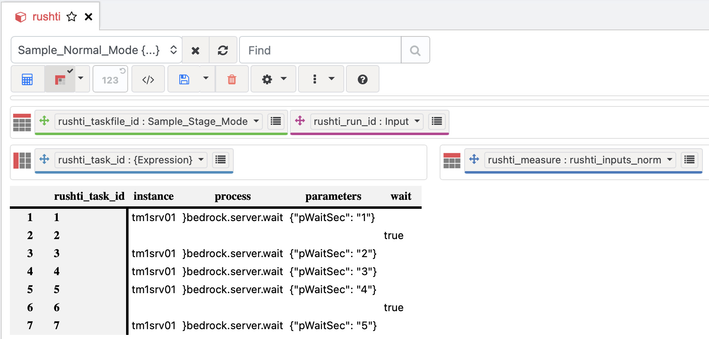
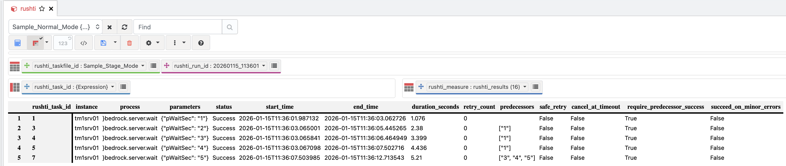

# Task File Basics

In the [Quick Start](quick-start.md) you created TXT task files and ran them. RushTI supports three ways to define tasks — pick the one that fits your workflow.

## TXT Files

TXT files are the simplest way to get started. Each line is a task, and you have two modes:

=== "Normal (with wait)"

    Tasks run in groups separated by `wait`. All tasks in a group run in parallel, then RushTI waits for the entire group to finish before starting the next.

    ```text
    instance="tm1srv01" process="}bedrock.server.wait" pWaitSec=2
    instance="tm1srv01" process="}bedrock.server.wait" pWaitSec=5
    wait
    instance="tm1srv01" process="}bedrock.server.wait" pWaitSec=4
    instance="tm1srv01" process="}bedrock.server.wait" pWaitSec=3
    ```

=== "Optimized (with dependencies)"

    Each task gets an `id` and lists which tasks must finish first via `predecessors`. No more `wait` — tasks start as soon as their specific dependencies are done.

    ```text
    id="1" predecessors="" instance="tm1srv01" process="}bedrock.server.wait" pWaitSec=2
    id="2" predecessors="" instance="tm1srv01" process="}bedrock.server.wait" pWaitSec=5
    id="3" predecessors="2" instance="tm1srv01" process="}bedrock.server.wait" pWaitSec=4
    id="4" predecessors="1,3" instance="tm1srv01" process="}bedrock.server.wait" pWaitSec=3
    ```

!!! tip "Use integer IDs"
    Always use integers (`"1"`, `"2"`, `"3"`, ...) for task IDs. This keeps things simple and is required if you plan to use [expandable parameters](../advanced/advanced-task-files.md) with MDX expressions.

---

## TM1 Cube

Instead of managing task files on disk, you can store task definitions directly in a TM1 cube. This lets TM1 administrators update workflows from Architect, Perspectives, or PAW — no file editing required.

### Set Up

Run the `build` command to create the required cube and dimensions:

```bash
rushti build --tm1-instance tm1srv01
```

This creates a `rushti` cube with dimensions for task file IDs, task IDs, run IDs, and measures (instance, process, parameters, predecessors, status, duration, etc.). It also loads two sample workflows so you can test immediately.

### Define Tasks in the Cube

Open the `rushti` cube in Architect or PAW. With `rushti_run_id = "Input"`, enter your task definitions:

<figure markdown="span">
  { loading=lazy }
  <figcaption>Task definitions in the rushti cube — each row defines one task</figcaption>
</figure>

Each task is defined by writing values to these measures:

| Measure | Description |
|---------|-------------|
| `instance` | TM1 server name (must match a `[section]` in config.ini) |
| `process` | TI process name to execute |
| `parameters` | JSON string, e.g. `{"pYear": "2026", "pRegion": "All"}` |
| `predecessors` | Comma-separated task IDs, e.g. `1,3` |
| `stage` | Optional stage name for grouping |

### Run Tasks from the Cube

```bash
rushti run --tm1-instance tm1srv01 --workflow daily-refresh --max-workers 4
```

RushTI reads the task definitions from the cube, builds the DAG, and executes — exactly like running from a file.

### View Results

When result pushing is enabled, RushTI writes execution results back to the same cube. Each run gets its own `rushti_run_id` element (e.g., `20260209_143022`), so you can see the full execution history:

<figure markdown="span">
  { loading=lazy }
  <figcaption>Execution results in the rushti cube — status, duration, errors per task</figcaption>
</figure>

See [TM1 Integration](../features/tm1-integration.md) for the full setup guide, including settings configuration and building dashboards in PAW.

---

## JSON Files

JSON is RushTI's native format — internally, all TXT files are converted to JSON before execution. Use JSON when you need:

- **Embedded settings** — override `optimization_algorithm`, logging, or retry behavior per task file
- **Rich metadata** — `workflow` (required for statistics, optimization, and TM1 integration)
- **Per-task options** — `timeouts`, `cancel_at_timeout`, `safe_retry`, `require_predecessor_success`
- **Stages** — group tasks into logical phases

```json
{
  "version": "2.0",
  "metadata": {
    "workflow": "my-tasks"
  },
  "tasks": [
    {
      "id": "1",
      "instance": "tm1srv01",
      "process": "}bedrock.server.wait",
      "parameters": { "pWaitSec": "2" }
    },
    {
      "id": "2",
      "instance": "tm1srv01",
      "process": "}bedrock.server.wait",
      "parameters": { "pWaitSec": "5" }
    },
    {
      "id": "3",
      "instance": "tm1srv01",
      "process": "}bedrock.server.wait",
      "parameters": { "pWaitSec": "4" },
      "predecessors": ["2"]
    },
    {
      "id": "4",
      "instance": "tm1srv01",
      "process": "}bedrock.server.wait",
      "parameters": { "pWaitSec": "3" },
      "predecessors": ["1", "3"]
    }
  ]
}
```

**Key fields:**

| Field | Required | Description |
|-------|----------|-------------|
| `id` | Yes | Unique task identifier — use integers (`"1"`, `"2"`, etc.) |
| `instance` | Yes | TM1 server name (must match a `[section]` in config.ini) |
| `process` | Yes | TI process name to execute |
| `parameters` | No | Process parameters as key-value pairs |
| `predecessors` | No | List of task IDs that must complete before this task starts |

!!! info "JSON is recommended when you want to customize"
    For quick runs and simple workflows, TXT files work great. Switch to JSON when you need metadata, embedded settings, stages, timeouts, or any of the advanced features covered in [Advanced Task Files](../advanced/advanced-task-files.md).

Run a JSON task file the same way:

```bash
rushti run --tasks my-tasks.json --max-workers 4
```

---

## Which Format Should I Use?

| | TXT | TM1 Cube | JSON |
|---|---|---|---|
| **Best for** | Quick tests, simple workflows | Teams managing tasks in PA | Workflows using advanced features |
| **Dependencies** | `wait` groups or `id`/`predecessors` | `predecessors` measure | `predecessors` array |
| **Settings** | CLI flags or settings.ini only | CLI flags or settings.ini only | Embedded in file + CLI + settings.ini |
| **Metadata** | None | Defined by cube structure | `workflow`, stages, per-task options |
| **Advanced features** | :material-close: | :material-check: | :material-check: Timeouts, stages, expandable params |

## Sample Files

Complete sample task files are available in the [`docs/samples/`](https://github.com/cubewise-code/rushti/tree/rushti2dot0/docs/samples) directory:

| File | Description |
|------|-------------|
| `daily-refresh.txt` | Simple 6-task workflow in TXT (normal mode with `wait`) |
| `daily-refresh-dag.txt` | Same workflow in TXT (optimized mode with `id`/`predecessors`) |
| `daily-refresh.json` | Same workflow in JSON format |
| `finance-close.json` | Complex 13-task multi-stage pipeline |

## Next Steps

- [:octicons-arrow-right-24: DAG Execution](../features/dag-execution.md) — understand how DAG-based scheduling works and why it's faster than levels
- [:octicons-arrow-right-24: Advanced Task Files](../advanced/advanced-task-files.md) — stages, timeouts, expandable parameters, safe_retry
