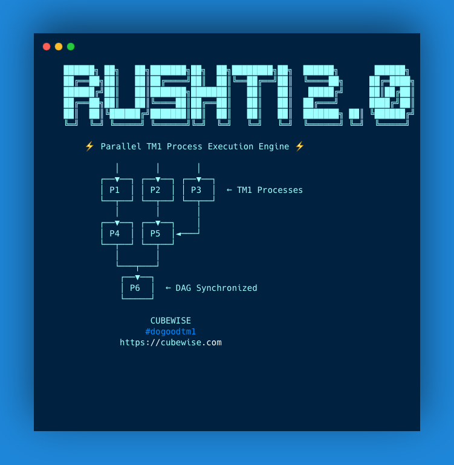

  

---

# RushTI Documentation

RushTI is a parallel execution engine for IBM TM1/Planning Analytics TurboIntegrator processes. It runs your TI processes in parallel, respects dependencies between them, and gets faster over time by learning from previous runs.

-   :material-rocket-launch-outline:{ .lg .middle } __Quick Start__

    ---

    Install RushTI and run your first parallel workflow in 10 minutes.

    [:octicons-arrow-right-24: Get started](getting-started/quick-start.md)

-   :material-file-document-outline:{ .lg .middle } __Task Files__

    ---

    Learn how to define your TI processes, parameters, and dependencies.

    [:octicons-arrow-right-24: Task file basics](getting-started/task-files.md)

-   :material-star-outline:{ .lg .middle } __Features__

    ---

    DAG execution, self-optimization, TM1 integration, exclusive mode, and more.

    [:octicons-arrow-right-24: Explore features](features/dag-execution.md)

-   :material-console-line:{ .lg .middle } __CLI Reference__

    ---

    All commands and options in one place.

    [:octicons-arrow-right-24: Command reference](advanced/cli-reference.md)

---

[:material-web: Website](https://cubewise-code.github.io/rushti/){ .md-button } [:material-github: GitHub](https://github.com/cubewise-code/rushti){ .md-button } [:material-package-variant: PyPI](https://pypi.org/project/rushti/){ .md-button }

